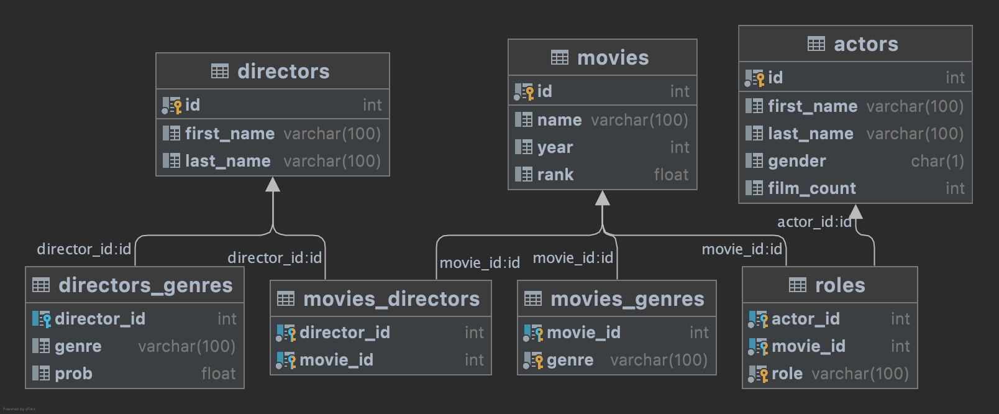
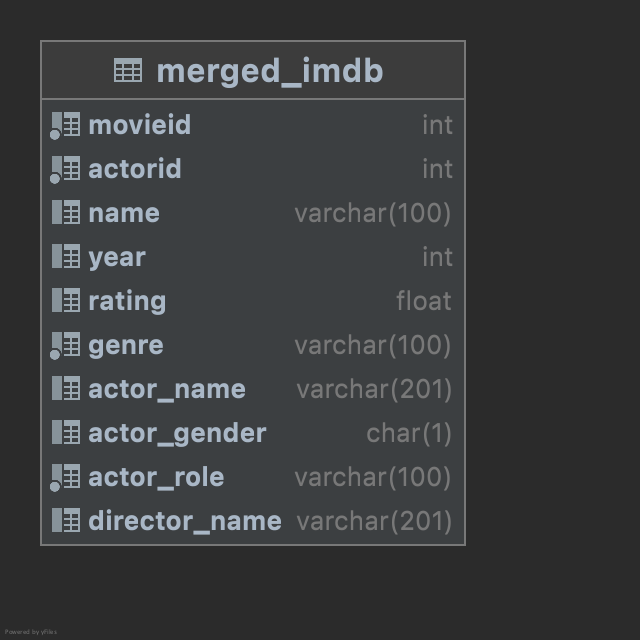
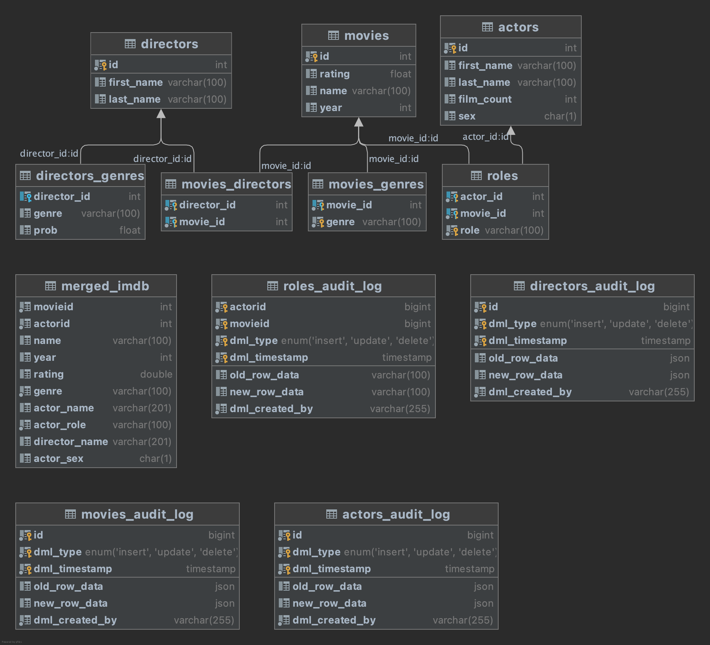

# IMDb Pipeline (Term I.)

> All files listed here can be found under my [Github repository](https://github.com/nszoni/ceu-dataeng1/tree/main/term1)

## Table of contents

1. [Introduction](#introduction)
2. [Operational Layer](#operational)
3. [Analytics (Business Definitions)](#business)
4. [Denormalization](#denorm)
5. [ETL Pipeline](#etl)
6. [Extras](#ex)
7. [Project Delivery](#delivery)

<div id='introduction'/>

## Introduction

I choose to work with data on movies because I am a huge fan of the industry and spend a lot of time browsing reviews.

Although IMDb itself offers open data, I chose to look for a smaller sample.

Thereupon, I found a [site](https://relational.fit.cvut.cz/search) which has a huge collection of dataset on their public `MariaDB` database.

I decided to go with the `imdb_small` dataset which has the following ERD:

<br/>

<p align="center">

</p>

*<center> Generated by DataGrip </center>*

<br/>

### Additional informations

As you can see the ERD represenets a a Snowflake Schema, therefore it has a more complex normalization and I should do more joins to get to the analytical layer.

- 36 distinct movies
- 1907 actors
- 34 directors
- 16 genres
- 1695 roles
- from 20 different years

<div id='operational'/>

## Operational Layer

I exported the tables as `.TSV` files from the database and [generated DDL scripts](https://www.jetbrains.com/datagrip/features/generation.html) for each table within DataGrip.

All the source files can be found under `data/` and pictures presented here under `pictures/`

*Note: The generation saved me a significant time in defining column names and datatypes, constraint and indexes.*

Having the data and table structure on my computer, I created tables with from generated schemas in my local MySQL instance with the `stg_create_tables.sql` script.

- Since `rank` is a reserved keyword in SQL, I will replace it with the name `rating`.
- Rename the column `gender` to `sex` in the actors table to avoid unambiguity

File loading was a bit messy, becuase I wanted to achieve the least repetition of `LOAD DATA LOCAL INFILE` command while allowing the user for replacing their absolute path at ease. Hence, I wrote a `shell` script for bulk loading the data which takes all the necessary credentials, plus working directory, truncates all the existing tables, and loads the data by iterating through all the files in the `data/` folder.

Make sure to edit the script according to your needs:

```{bash}
#!/bin/bash

dir=/path/to/the/directory/where/the/data//is/stored
user=root
password=yourpassword
database=imdb

...
```
Run the script:

```
bash stg_bulk_extract.sh
```

Please note, that it is insecure to supply credentials inside a script! An alternative way would be to write an extra mysql config file consisting all of those with read-only to the root user (chmod 600). To do that see [this](https://www.serverlab.ca/tutorials/linux/database-servers/how-to-create-a-credential-file-for-mysql/) article. I did not set this up as it would have complicated things much more and I tried to be as simple as possible akin to this being a school-project.

<div id='business'/>

## Analytics (Business Questions) <a name="business"></a>

The final form of the data mart should be able to answer the following business questions.

### List of analytics

- How many movies are in each genre? What is the distribution?
- What was the most successful year in movie production?
- Which actor/actress has appeared in the most roles?
- In which genre of movies we have the highest likelihood of seeing an actor/actress?
- What is the average rating of movies directed by Quentin Tarantino?
- Do we see a gender equity in terms of appearance in movies?
- List the directors who also include themselves in movies!

<div id='denorm'/>

## Denormalization <a name="denorm"></a>

I merged together all the dimension and fact tables to a joint table, and concatenated the first and last names of the actors, directors. Now, each entity represents an "actor/actress in a movie in a certain role" (assuming that an actor/actress can have multiple roles in a movie). It should be enough to answer the questions mentioned above (I wrote sample analytical queries which you can run in `mart_analytical_queries.sql`).

<br/>
<p align="center">

</p>
<br/>

<div id='etl'/>

## ETL Pipeline

### Extract

Data is extracted from local source files with the following template to the table generated with custom DDL.

```{sql}
LOAD DATA LOCAL INFILE '/Users/nszoni/Desktop/repos/ceu-dataeng1/term1/data/imdb_small_actors.tsv'
INTO TABLE actors
COLUMNS TERMINATED BY '\t'
IGNORE 1 LINES;
```

### Transform

See: `int_transform.sql`

- Interestingly, *Batman Begins (2005)* and *Pirates of the Carribbean (2003)* has a 0 average rating, while it is currently rated 8.2 and 8.0 on imdb, respectively. Let's manually update those entries!
- Some roles are has values of `""` which should be `'unknown'` instead.

To denormalize the Snowflake Schema and make a few transformations, I inserted the following SELECT statement to a body of a stored procedure - `denormalizeimdb()`

```{sql}
select
    movies.id as movieid,
    actor_id as actorid,
    name as name,
    year as year,
    movies_genres.genre as genre,
    sex as actor_sex,
    role as actor_role,
    round(rating, 2) as rating,
    rtrim(ltrim(
            concat_ws(' ',
                coalesce(actors.first_name, ''),
                coalesce(actors.last_name, '')
            ))) as actor_name,
    rtrim(ltrim(
            concat_ws(' ',
                coalesce(directors.first_name, ''),
                coalesce(directors.last_name, '')
            ))) as director_name
from
    movies
inner join
    movies_directors on movies.id = movies_directors.movie_id
inner join
    movies_genres on movies.id = movies_genres.movie_id
inner join
    roles on movies.id = roles.movie_id
inner join
    directors on movies_directors.director_id = directors.id
inner join
    actors on roles.actor_id = actors.id;
```

### Load

Loading will be performed upon transformation as I created a separate table for the data mart, and implemented a scheduled refresh of the table with the following query under `models/mart/mart_materialized_view.sql`. For the analytical layer where a lot of ad hoc query will be performed, it is indisposable to have a materialized view instead of the standard view.

```{sql}
CREATE EVENT materialized_imdb
  ON SCHEDULE
    EVERY 1 DAY
    STARTS (TIMESTAMP(CURRENT_DATE) + INTERVAL 1 DAY + INTERVAL 1 HOUR)
  DO
 BEGIN
     CALL DenormalizeImdb();
     CREATE INDEX index_movie_actor
        ON merged_imdb(movieid, actorid);
```

As a plus, I also created a composite index on the `movieid` and `actorid` columns for better query performance.

<div id='ex'/>

## Extras

### Data Quality Checks (Testing)

Testing is inevitable when going into the production environment and data trustworthyness.

To test the new incoming data, I set up a few triggers scanning for data anomaly.

1. Ratings should be in the interval of 1 to 5 - `before_movie_[insert/update]_movieRating`
2. Year should not be negative or in the future (greater than the current year) - `before_movie_[insert/update]_movieYear`
3. Sex (not gender!) of the actors should be binary (either Male of Female) - `before_actors_[insert/update]_sexInSet`
4. film_count field should not be negative - `before_actors_[insert/update]_filmCountIsNegative`

```{sql}
create trigger before_movie_insert_movieRating before insert on movies
for each row
begin
    if ((new.rating < 1) OR (new.rating > 10)) then
	signal sqlstate '42000'
    set message_text = 'The rating of the movie is out of bounds, pls check it!';
	end if;
```
*Note: demo DML queries are included in the script*

### Change Data Capture (CDC)

For loging the changed data in the movies, actors, directors, and roles table, I set up triggers for inserts, updates, and deletes for each tables as `<tablename>_audit_log`. Each audit table records the old data, new data (as JSON objects), timestamp, and the user who executed the DML. The inserts to the CDC table are managed by triggers.

```{sql}
CREATE TRIGGER movies_update_audit_trigger
AFTER UPDATE ON movies FOR EACH ROW
BEGIN
    INSERT INTO movies_audit_log (
        id,
        old_row_data,
        new_row_data,
        dml_type,
        dml_timestamp,
        dml_created_by
    )
    VALUES(
        NEW.id,
        JSON_OBJECT(
            "name", OLD.name,
            "year", OLD.year,
            "rating", OLD.rating
        ),
        JSON_OBJECT(
            "name", NEW.name,
            "year", NEW.year,
            "rating", NEW.rating
        ),
        'UPDATE',
        CURRENT_TIMESTAMP,
        CURRENT_USER()
    );
```

Expected behavior when updating a row:

<p align="center">

</p>

*Note: demo DML queries are included in the script*

<div id='delivery'/>

## Project Delivery

All in all, the flow is the following:

**1. Manual ingestion at a stage level with bulk shell script**

**2. Automatic daily transformations**

**3. Loading with ad hoc triggering, testing and CDC logging**

The final for of database can be described with the following chart:

<p align="center">

</p>

### Structure

To deliver my project, I followed the following tree system

```{bash}
term1
├── NNS_imdb_pipeline.md
├── data
│   ├── imdb_small_actors.tsv
│   ├── imdb_small_directors.tsv
│   ├── imdb_small_directors_genres.tsv
│   ├── imdb_small_movies.tsv
│   ├── imdb_small_movies_directors.tsv
│   ├── imdb_small_movies_genres.tsv
│   └── imdb_small_roles.tsv
├── models
│   ├── intermediate
│   │   ├── int_denormalize.sql
│   │   ├── int_etl_actors.sql
│   │   ├── int_etl_directors.sql
│   │   ├── int_etl_movies.sql
│   │   └── int_etl_roles.sql
│   ├── mart
│   │   ├── mart_analytical_queries.sql
│   │   └── mart_materialized_view.sql
│   └── stage
│       ├── stg_create_tables.sql
│       └── stg_extract.sql
└── pictures
    ├── cdc.png
    ├── imdb_small_erd.png
    └── merged_imdb.png
 ```

### SQL and Markdown Linters

To keep consistent SQL and Markdown conventions and pretty formatting, I used [sqlfluff](https://github.com/sqlfluff/sqlfluff) to lint all my .sql files and used the a VSCode Extension called [markdownlint](https://marketplace.visualstudio.com/items?itemName=DavidAnson.vscode-markdownlint) to follow the standard styling. sqlfluff formatting options can be found under `term1/.sqlfluff`

**Make sure to run the queries found under `/models/mart/mart_analytical_queries.sql` to get your answers on the business questions!**
